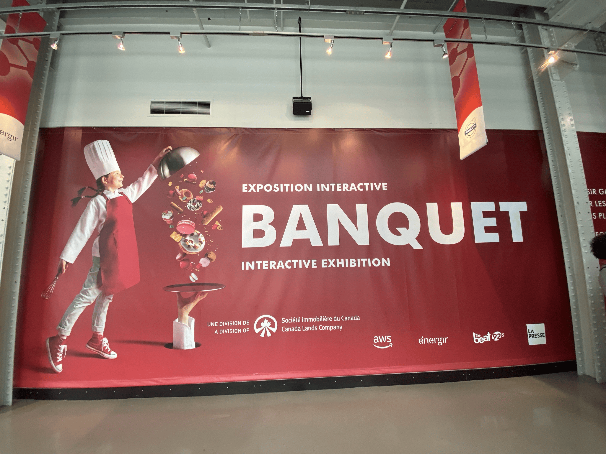

## Le Banquet ##

**Photo par Sara Pop**

Le Banquet est une exposition temporaire et interactive qui se trouve au centre des science de Montreal. Cette exposition nous fais parcourir le milieu de la gastronomie toute en etant interessante mais aussi en sachant garder notre attention avec les multiple dispositif qui nous sont offert. Je souhaite donc vous partager les nombreuses decourte que j'ai fait la visite de cette exposition le 31 janvier 2025. https://www.centredessciencesdemontreal.com/exposition-temporaire/l-exposition-interactive-banquet

## Les plats signatures ##

**Photo par Sara Pop**

*Par Cité des sciences et des l'industrie en partenariat avec Inrae.*

Certain peuvent penser que la présentation d'un plats est banale, mais pour certain, la création de plats magnifique qui regroupe le talent et la créativiter des artistes est toutefois très intéressante. Ce dispositif intéractif est installé sur une table noir et blanche. Ont peut y retrouver trois dessert sous des cloches transparente, puis trois autre sous des cloches argentes que vous pouvez ouvrire pour y découvrir trois autre plats. Les desserts sont accompagner d'une plaque deux bouttom qui permette de commencer l'experience interactive. Ils nous permettent d'ecouter chaque etape de la realisation de ces desserts et le chef qui l'a concus. Sous les trois autres cloches, nous pouvons trouvez trois oeuvres realiser par different artiste qui sont inspire par des plats. Pour finir, un ecrans est placer sur la table et nous pouvons obeserve les chefs cree leur chef d'oeuvre.

## Mise en espace ##

 **Photo par Rosalie Vaillancourt**  **Photo par Rosalie Vaillancourt**  **Photo par Rosalie Vaillancourt**

