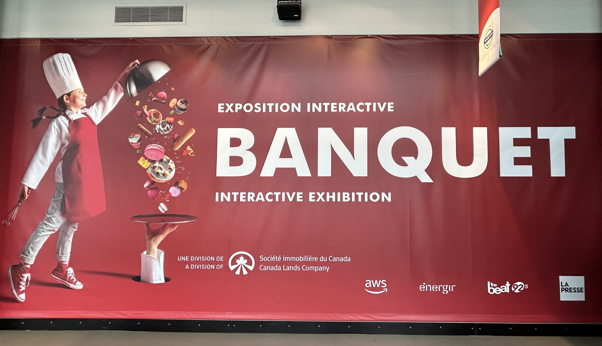

## Le Banquet ##

**Photo par Rosalie Vaillancourt**

Le Banquet est une exposition temporaire et interactive qui se trouve au centre des science de Montréal. Cette exposition nous fais parcourir le milieu de la gastronomie toute en étant intéressante mais aussi en sachant garder notre attention avec les multiples dispositifs qui nous sont offert. Je souhaite donc vous partager les nombreuses décourtes que j'ai fait à la visite de cette exposition le 31 janvier 2025. https://www.centredessciencesdemontreal.com/exposition-temporaire/l-exposition-interactive-banquet

## Les plats signatures ##

**Photo par Sara Pop**

*Par Cité des sciences et des l'industrie en partenariat avec Inrae.*

Certains peuvent penser que la présentation d'un plats est banale, mais pour certain, la création de plats magnifique qui regroupe le talent et la créativiter des artistes est toutefois très intéressante. Ce dispositif intéractif est installé sur une table noir et blanche. Ont peut y retrouver trois desserts sous des cloches transparentes, puis trois autres sous des cloches argentés que vous pouvez ouvrires pour y découvrir trois autres plats. Les desserts sont accompagné d'une plaque avec deux bouttoms qui permettent de commencer l'expérience interactive. Ils nous permettent d'écouter chaque étape de la réalisation de ces desserts et le chef qui l'a concus. Sous les trois autres cloches, nous pouvons trouvez trois oeuvres réalisé par differents artistes qui sont inspiré par des plats. Pour finir, un écran est placé sur la table et nous pouvons obeserver les chefs crée leur chef d'oeuvre.

## Mise en espace ##

Photo par Alain Roberge, la Presse. https://www.lapresse.ca/gourmand/centre-des-sciences/gastronomie-science-et-plaisir/2024-06-30/banquet/interactivite-au-menu.php

# Technique et composante #

 **Photo par Rosalie Vaillancourt**  **Photo par Rosalie Vaillancourt**  **Photo par Rosalie Vaillancourt**

## Plaque en argent ##
  

# Composante fournies #
-Table

-Fils audio

-écran/fils pour l'écran

-Haut-parleur

## Mon opinion ##
J'ai trouvé l'exposition très intéressante et j'ai choisi ce dispositife puisque qu'il était simple mais très captivant à la fois. Par contre, j'ai trouvé que le son n'était pas très fort et l'audio était difficle à comprendre. Toutefois, c'était une belle exposition qui vallait la penne et une belle sorite à faire entre amis. 

