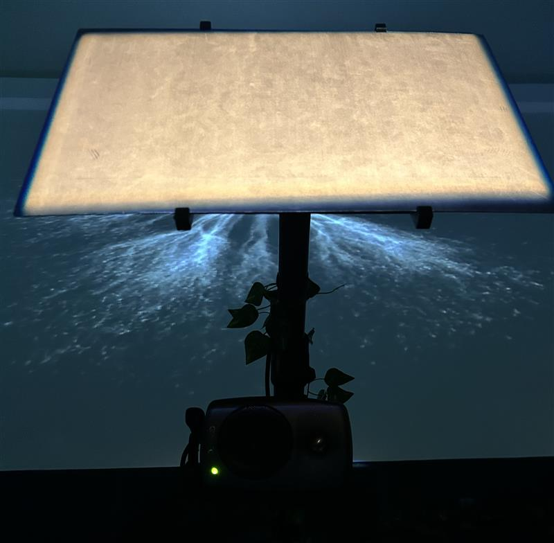
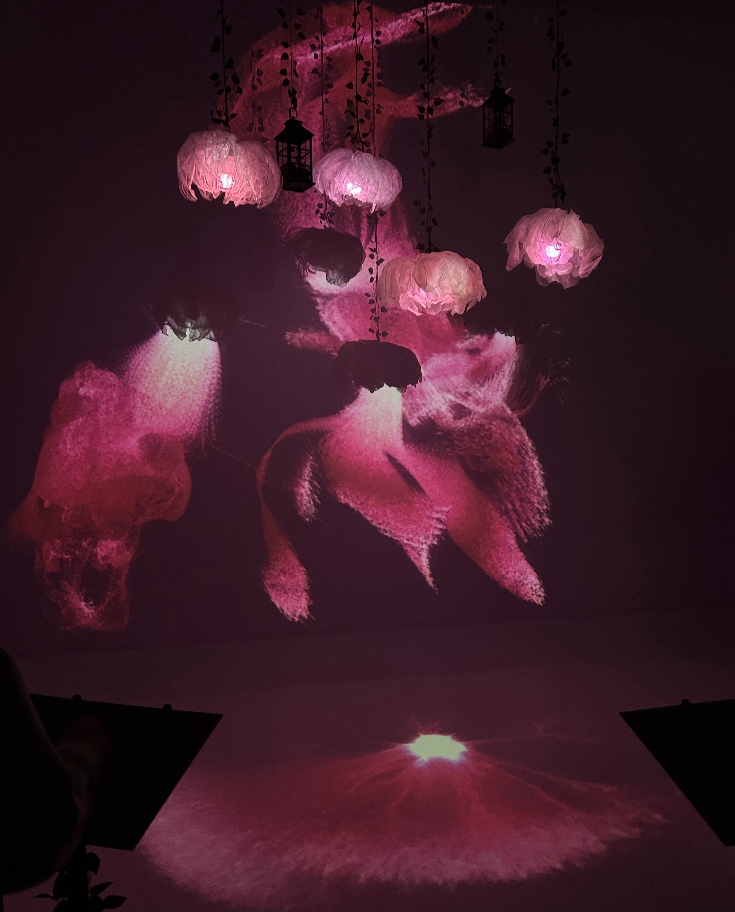
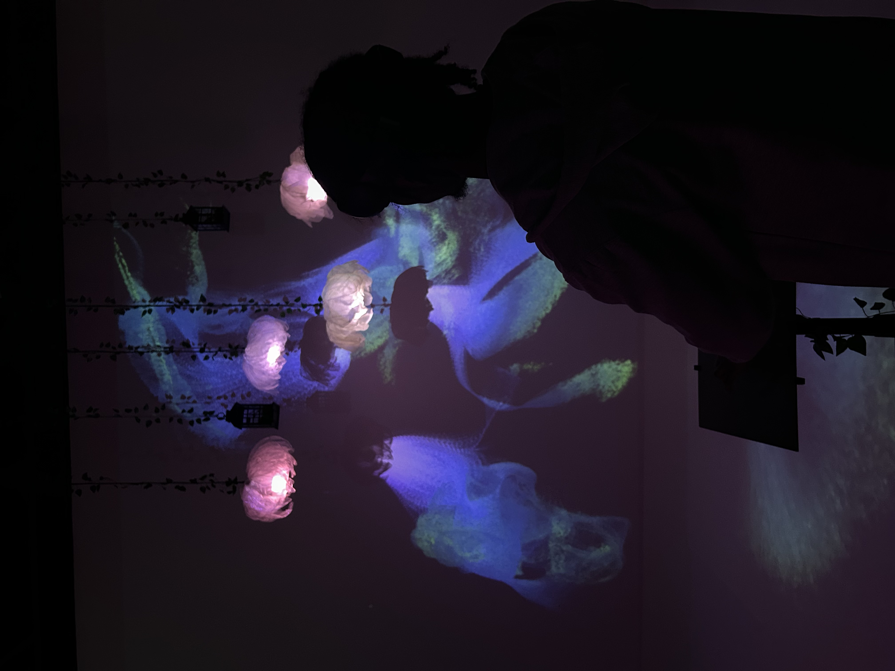

## Projets Luminatura de la Technique d'Introduction en Multimédia ##

Résonance est une exposotion intéractive et temporaire, présenter par les finissant et finissante de la technique d'introduction en multimédia. Cette exposition est présenter dans le grand studio du Collège Montmorency. Lors de notre visite le 18 mars 2025, nous avons pus observer chaque projet, qui explore un angle unique d'interaction humaines, de reflexion avec la nature ou d'onde émotionelle. 

>**photo par Rosalie Vaillancourt**

## Présentation du concept et de l'équipe ##

Luminatura est un project multimédia qui mélange nature et technologie que nous présente cinq étudiant de dernière année ici, au collège Montmorency. Cette installation intéractive où des fleurs illuminées, des vignes, et des lanternes réagissent au simple contacte de notre peau. Le thème étant d'explorer la communication entre la nature et l'être humain, en touchant une plaque de métal, le capteur détecte la conductivité de l'utilisateur et déclenche des effets sonor et lumineux. 

Le dispositif, créée par Audrey, Justine, Camilia, Prethiah et Ihab, vise à nous présenter et à nous faire vivre une expérience immersive et intéractive.

## Plaque et dispositif sonore ##

>**photo par Rosalie Vaillancourt**

Le coeur de l'intéraction est dans les plaques de métal que les gens peuvent manipuler et qui feras apparaître des lumières. Deplus, des effets sonore inspiré de la nature par exemple, un ruisseau, des oiseaux ou bien des murmures, sont émis se qui crée une ambiance apaisante qui accompagne le visiteur dans son expérience immersive. 

-Plaque en acier

-Minicontrôleur

-Trois résisteurs

-Cable Ethernet

-Ruban adhésif métalique

-Cable en acier

-Trépied

-Deux supports imprimés en 3D

## Visuel ##

Ensuite, une ambiance calme et reposante a été créé avec des fleurs lumineuse suspendue à des vignes et des lanternes.

>**photo par Rosalie Vaillancourt**

## Expérience personelle ##

J'ai personellement beaucoup aimer l'activté interactive. J'ai trouvés se projet très apaisant et créatif. L'intéractivité est très bien effectuer et nous fais voyager avec les lumière et les sons qui se dégage de cette oeuvre. J'ai aussi trouver que les fleur était très joli et bien fait, ont voit les efforts qu'y ont été mis dans se projet et la beauté qui en ressort.

>**photo par Rosalie Vaillancourt**
