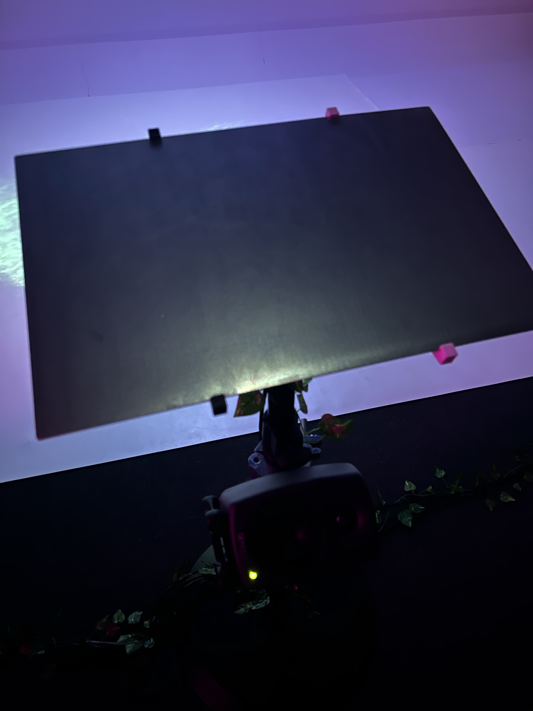

## Projets finissants de la Technique d'Introduction en Multimédia ##

>**photo par Rosalie Vaillancourt**

## Présentation du concept et de l'équipe ##

Luminatura est un project multimédia qui mélange nature et technologie que nous présente cinq étudiant de dernière année ici, au collège Montmorency. Cette installation intéractive où des fleurs illuminées, des vignes, et des lanternes réagissent au simple contacte de notre peau. Le thème étant d'explorer la communication entre la nature et l'être humain, en touchant une plaque de métal, le capteur détecte la conductivité de l'utilisateur et déclenche des effets sonor et lumineux. 

Le dispositif vise à nous présenter et à nous faire vivre une expérience immersive et intéractive.

## Plaque et dispositif sonore ##

>**photo par Rosalie Vaillancourt**
