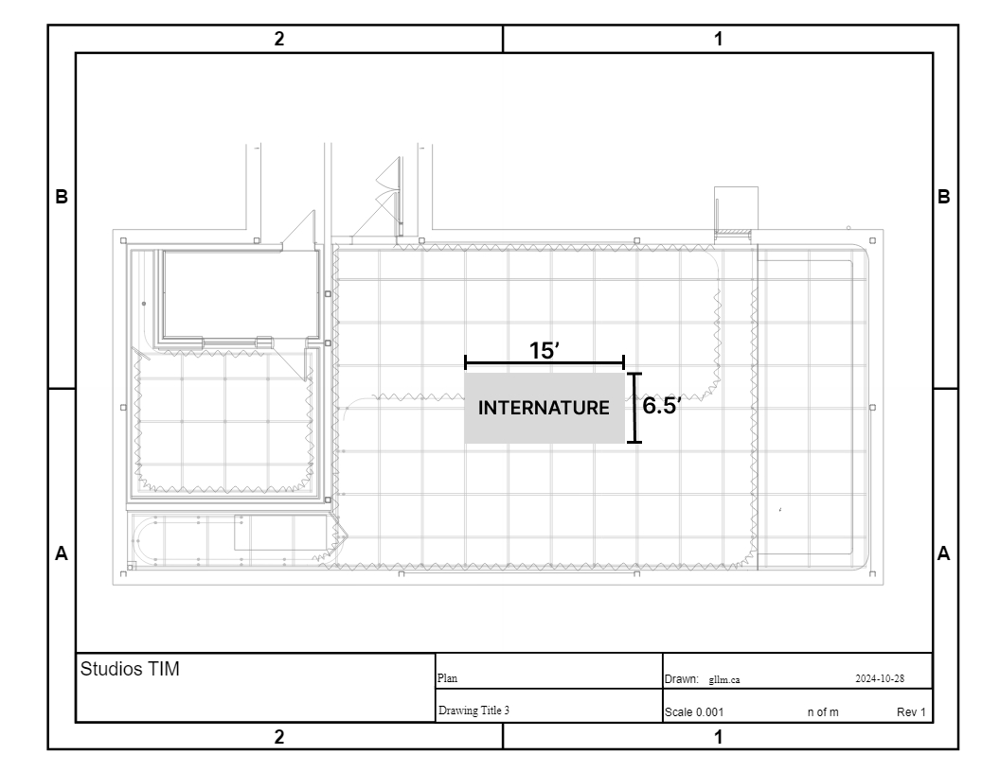

## Projets finissant de la Technique d'Introduction en Multimédia ##

Du 17 au 21 mars, les élèves finissants de la Technique d'Introduction en Multimédia nous ont présenter sept projets qu'ils ont réaliser. C'est projet intéractif, certains sonore, visuelle alors que d'autre sont emotionelle ou philosophique, explore l'intéraction humaine avec la technologie. 

>[link]https://tim-montmorency.com/2025/#/

## 2. Internature ##

Créé par Khaly, Isaac, Delphine, Sitmontemna et Kenza, Internature est un tunnel interactif où les visiteurs peuvent controler l'évolution des projections qui recréer des plantes en manipulant une sphère. Cette expérience immersive, semblable au mythe de Sisyphe, nous présente une sphère que nous pouvons bouger et qui provoque la croissance des plantes qui sont projetée sur les parois du tunel. 

Se projet est fonctionnel grace à:

-Un environnement renfermé

-Une surface pour la projection

-Deux projecteurs

-Deux haut-parleur et une carte de son

-Une sphère

-Un support pour la sphère

-Un ordinateur

## Visuel ##

Dans cette expérience interactive, lorsque la sphère est en mouvement, le mapping video va s'accroitre selon la direction de la sphère pour projeter des plantes synthétique sur les parois du tunnel. Si l'uilisateur arrête, l'animation va donc régresser jusqu'à disparaitre jusqu'au prochain mouvement. De plus, lorsque la sphère est en mouvement, une musique qui diffusera un ambiance calme et sombre se mettra a jouer en boucle.

>**photo par l'équipe d'Internature**

>**photo par l'équipe d'Internature**

>**photo par l'équipe d'Internature**

## Experience personelle ##

J'ai trouvé l'experience très agréable, j'ai trouvé l'idée très créative et bien fait. Je trouve que se projet immersif est très apaisant mais aussi amusant à faire fonctionner.

>**photo par Rosalie Vaillancourt** 

## 3. Fuga ##

Créé par Matis, Tristan, Daniel, Abdel, Yavuz, Fuga est une installation intéractive permettant au utilisateur de créer un arbre en 3D en manipulant un générateur de signaux qui produit des sons, permettant la croissance de l'arbre. Les utilisateurs peuvent expérimenter les fréquences et les paramètres pour trouver le bon équilibre. Le projet permet un environnment calme et unique et demontre qu'on peut utiliser la technologie de manière responsable et réfléchie. 

>**photo par Rosalie Vaillancourt**

Se projet est fonctionelle grace à:

-Instrument de musique

-Télévisions

-Deux haut-parleurs

-Décor recycler

-Acessoir (Cable, support, carte audio/video)

>**photo par Rosalie Vaillancourt** 

>**photo par Rosalie Vaillancourt** 

## Visuel ##

>**photo par l'équipe de Fuga**

>**photo par l'équipe de Fuga**

## Experience personelle ##

J'ai trouver l'expérience très relaxante et captivante à la fois. Je trouve que le projet était très créatif et démontre que la technologie peut être de bonne usure avec l'environnement

>**photo par Rosalie Vaillancourt**

## .4 Prismatica ##

Créé par Vincent, Ikrame et Jeremy, Prismatica est une installation intéractive qui repose sur la chrosmesthesie, les sons étant perçu par les couleurs. Grâce à une camera connecter à TouchDesigner, elle analyse depuis un tableau blanc se que l'utilisateur dessine. Chaque couleurs joue un son specifique basée sur le cercle chromatique transformant le dessin en une expérience multisensorielle dans laquelle les sons, les couleurs et les images, fusionne.

>**photo par Rosalie Vaillancourt**

## Visuel ##

L'installation repose sur la projection en temps réel des projects des utilisateurs. À la fin, le dessin s'efface progressivement, pour laisser place à la prochaine oeuvre.

>**photo par l'équipe de Prismatica**

Se projet est fonctionnel grace à:

-Caméra

-Projecteur lumière

-Projecteur au mur

-Haut-parleur

-Câblage

-Synthétiseur

-Crayon feutre/Tableau blanc

## Experience personelle ##

J'ai trouver

## 7. Etheria ##

Créé par Joshua, Victor, Michael, Pierre-Luc et Maik, Etheria est un projet interactif pixelisé qui nous présente un jeu de plusieurs manche. Les utilisateurs utilise des figures ou pions pour défendre une pierre des ennemies. De plus, le jeu se déroule dans un univers fantastique et des "power-ups" peuvent être récolter, mais rendre le jeu plus difficile.

Cette activité interactive vise à créer un univers fantastique ou les utilisateurs doivent collaborer pour réussir le jeu

>**photo par Rosalie Vaillancourt**

Se projet est fonctionelle grace à:

-Capteur de mouvement

-Processeur

-Ordinateur

-Deux haut-parleur

-Lumières infrarouges/lumière avec projecteur

>**photo par Rosalie Vaillancourt**

## Experience personelle ##

J'ai trouver le projet très impressionant mais vers la fin, j'ai trouvé que les manches étais longue et devenais un peut lassante.
