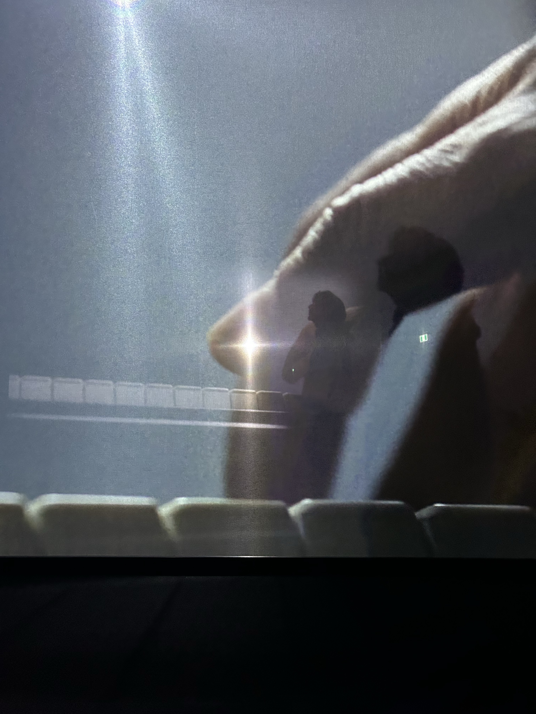
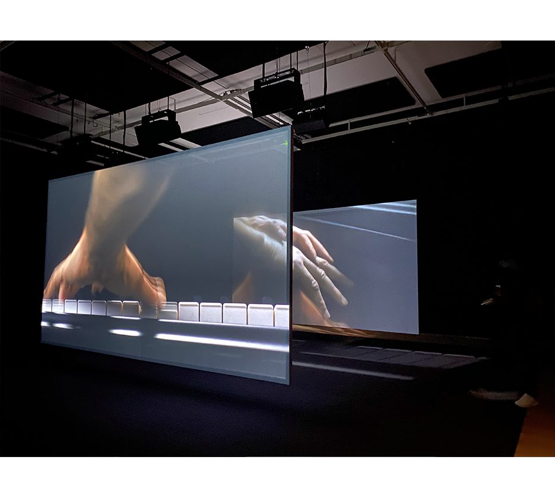
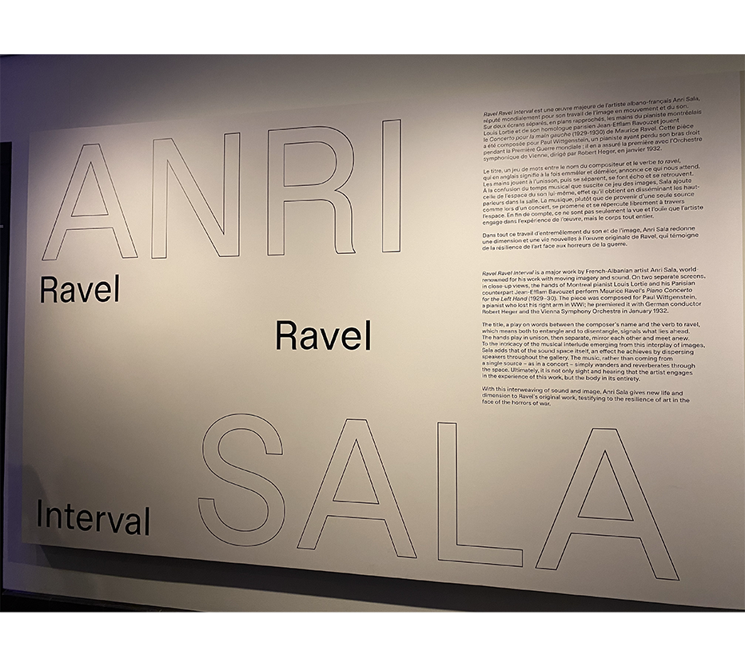
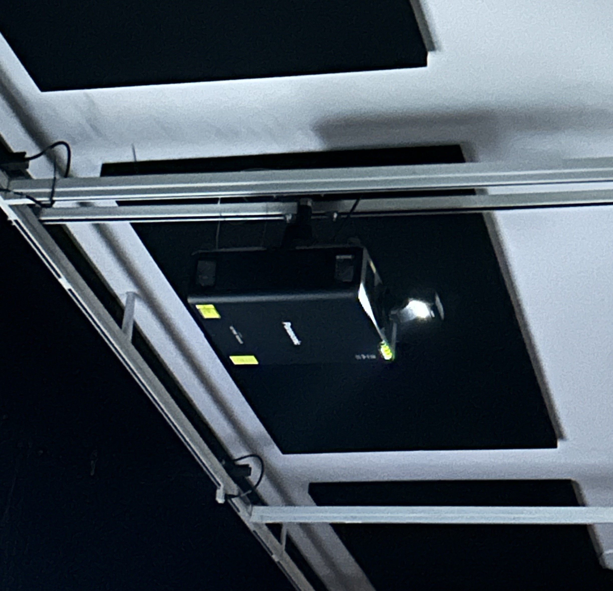
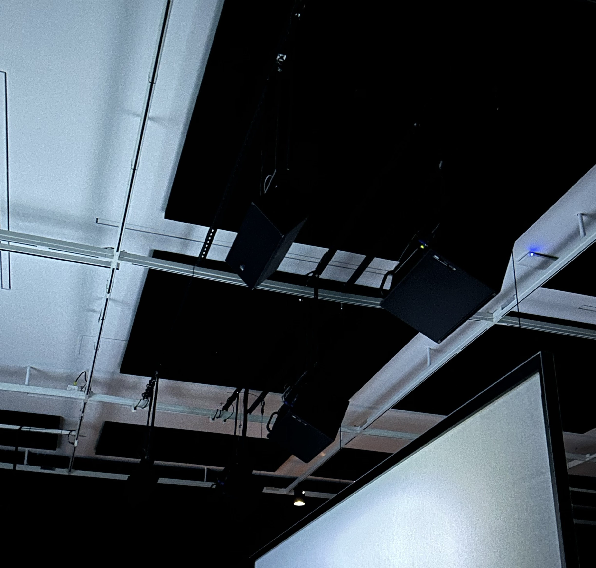

## Exposition Musée des beaux-arts de Montréal ##

# Ravel Ravel #

>**Photo par Rosalie Vaillancourt**

Cette installation de deux interprétation du *Concerto pour la main gauche* de Maurice Ravel (1875-1937), sont présentées simultanément. La pièce est le résultat d'un pianiste Paul Wittgenstein, suite à l'amputation de son bras droit. Ces deux interprétations met en lumière la sensibilité humaine, qui nous invite a accepter le flottement comme essentielle à notre expérience artistique et personelle.

## Mise en place ## 

>**Photo par Sara Pop**

>**Photo par Sara Pop**

À l'entrée de la salle, sur un mur, une présentation de l’artiste explique les raisons qui l'ont poussé à créer cette œuvre, en français et en anglais. En avançant, un long couloir se dévoile avant d’accéder à la pièce principale, où deux grands tableaux sont installés au centre. 

Dans se projet immersif, une vidéo de 20 minutes est projetée sur des écrans, montrant uniquement les mains gauches de deux pianistes. Au fil du temps, ont peut entendre qu'ils jouent deux parties de la pièce différente pour au final, de nouveau se synchroniser. Cette pièce exprime les horreurs et les conséquences vécu par l'artiste. Le son est diffusé par une multitude de haut-parleurs cachés dans la salle, enveloppant les spectateurs dans une ambiance sonore immersive.

## Composantes ##

>**Photos par Rosalie Vaillancourt**

À l'entrer, une plaque nous indique les composantes de l'oeuvre. Les projecteurs sont positionner au font de la salle, où sont aussi plasser des bancs pour que les spectateurs puissent sassoirent et a l'entrer. De plus, les haut-parleurs était placer au dessus des écrans un a coter de l'autre.

## Mise en exposition ##
### Fournis par l'artiste ###

* La vidéo des mains et la composition
* Les écrans
* La plaque de description
### Fournis par le musée ###
* Projecteurs
* Les haut-parleurs
* La salle

## Expérience vécue ##

J’ai été très absorbé·e par cette pièce. L’histoire qu’elle raconte est bouleversante, et la musique est envoûtante. Cependant, j’ai trouvé que 20 minutes, c’était peut-être un peu long. Malgré cela, je recommanderais cette œuvre immersive sans hésitation.
