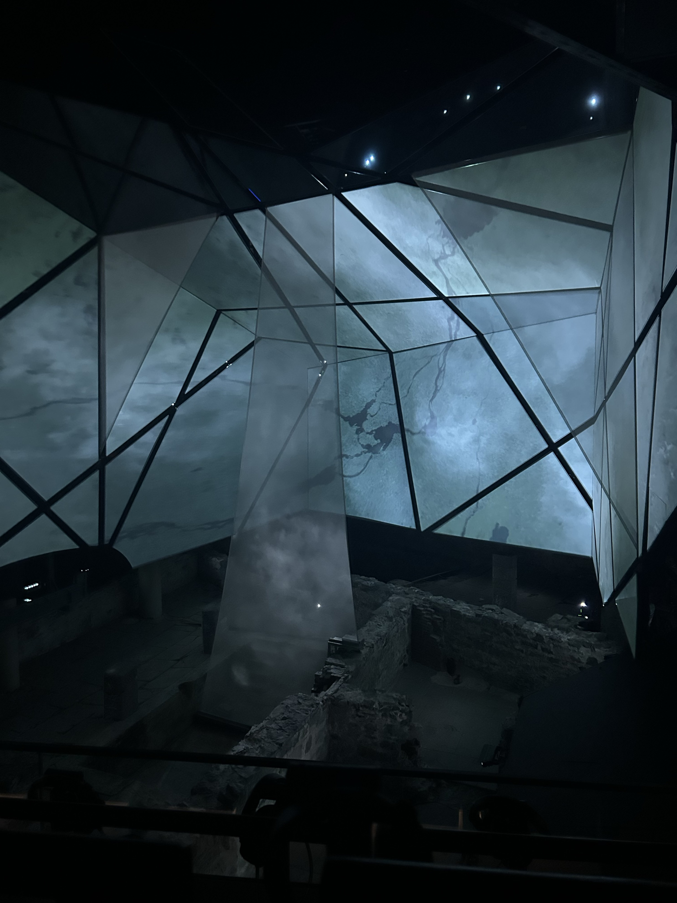
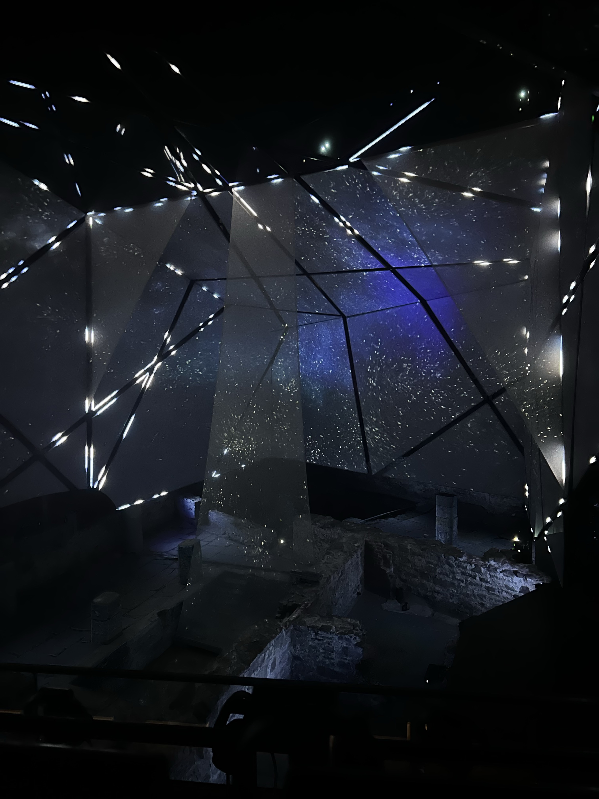
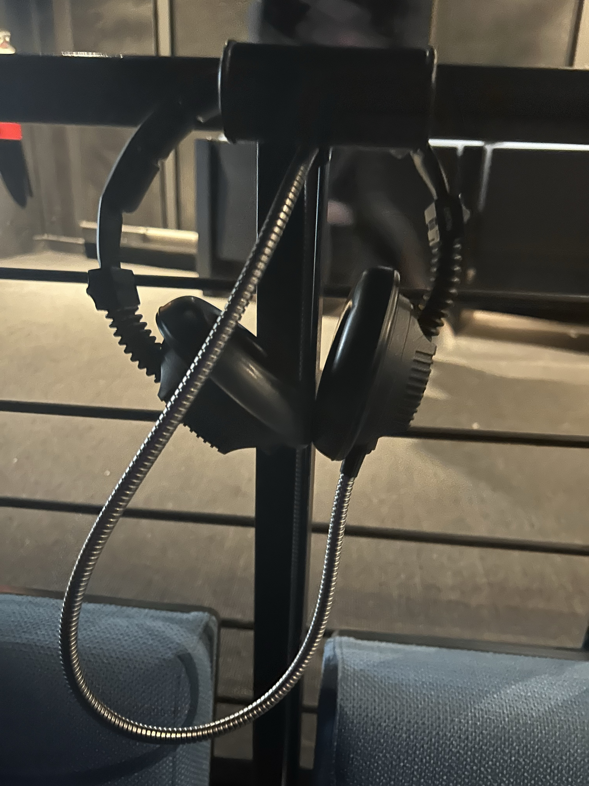
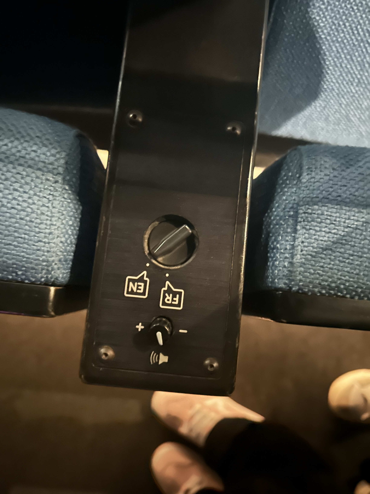
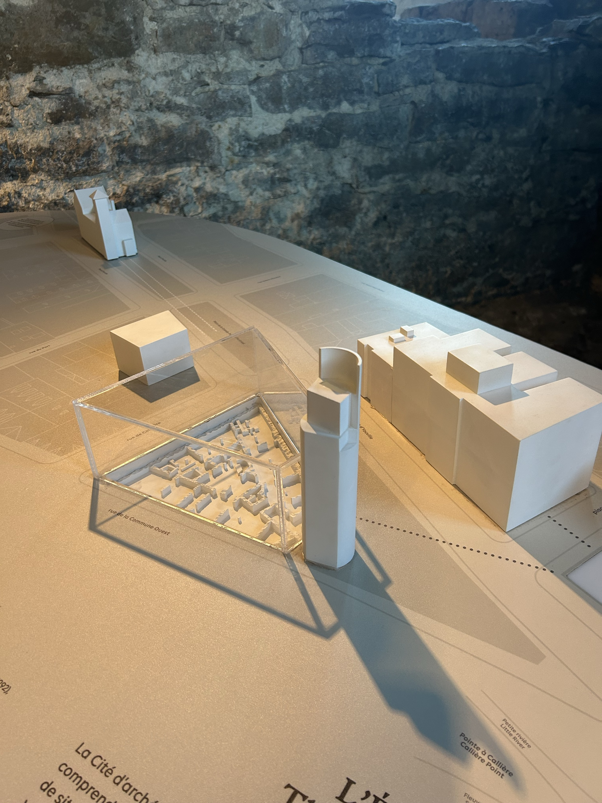
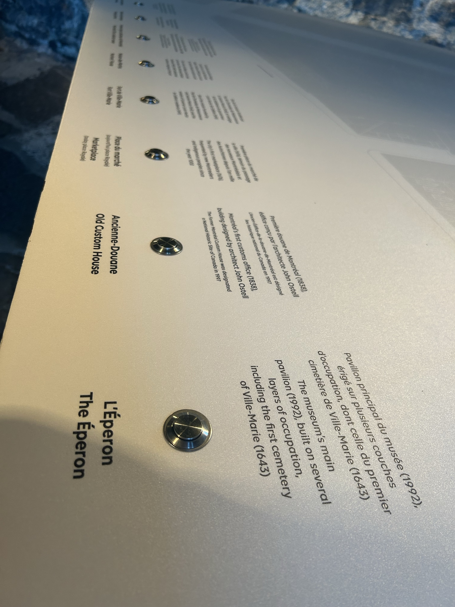
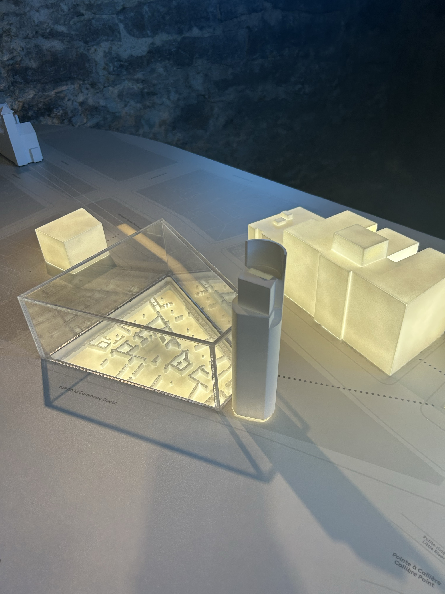

## Musée Pointe-à-Callières ##

# Spectacle multimédia génération MTL #

>**Photo de Rosalie Vaillancourt**

L'exposition Génération MTL est une immersion captivante dans l'histoire de Montréal, mettant en lumière les vestiges archéologiques et les événements marquants qui ont façonné la ville. L'exposition se distingue par son approche immersive et interactive, qui permet de revisiter les moments clés de l'histoire de Montréal, tout en découvrant les figures emblématiques qui ont contribué à sa construction. Ce projet allie de manière remarquable les avancées technologiques à une sensibilité artistique, insufflant ainsi une nouvelle vie à l’histoire de la métropole.

# Mise en espace #

>**Photo de Rosalie Vaillancourt**

La grande salle d'exposition est aménagée avec plusieurs rangées de sièges orientées vers une série d’écrans géants assemblés pour ne former qu’un seul dispositif. Un film d'une durée de 17 minutes est projeté, retraçant l’histoire de la ville, depuis sa fondation jusqu'à nos jours. L’expérience peut durer plus d’une heure, en fonction du temps que l’on souhaite consacrer à l’exploration des différents éléments de l'exposition. Après la projection du film, les visiteurs peuvent déambuler dans les couloirs du musée, où sont présentés de nombreux objets, plans, photographies et vidéos historiques.

>**Photo de Rosalie Vaillancourt**

>**Photo de Rosalie Vaillancourt**

Les sièges sont équipés de commandes permettant de régler le volume sonore ainsi que de sélectionner la langue de projection (français ou anglais).

Des maquettes éclairées sont également installées sur des tables interactives, offrant des informations détaillées (français et anglais) sur les sites représentés et leur histoire.

J'ai trouvé cette exposition à la fois fascinante et instructive. L’histoire de Montréal y est racontée de manière claire et dynamique, depuis les Premières Nations, en passant par la conquête britannique, jusqu’à l’époque contemporaine. Les éléments visuels, les effets spéciaux et les objets exposés contribuent à rendre cette expérience particulièrement enrichissante.

# Conclusion #

En résumé, l'exposition Génération MTL constitue une expérience immersive de grande qualité, alliant patrimoine historique et innovation technologique. Elle offre aux visiteurs une occasion unique de redécouvrir l’histoire de Montréal sous un angle moderne et interactif. Cette exposition est vivement recommandée à toute personne désireuse de mieux comprendre l’évolution de la ville et les événements qui ont façonné son identité.

